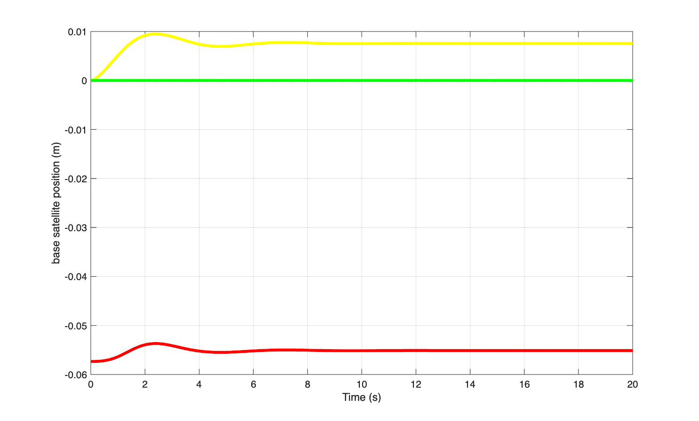
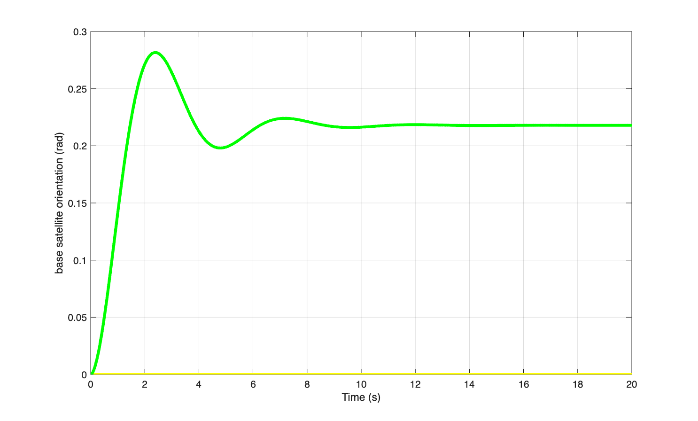
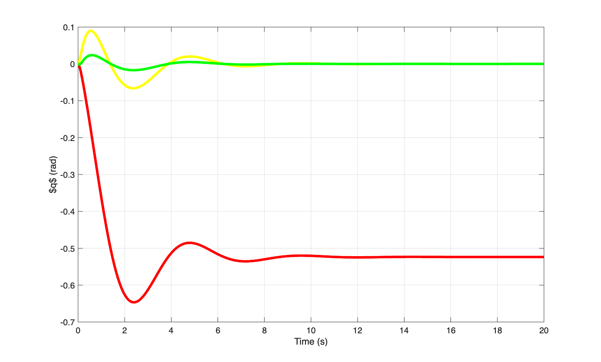
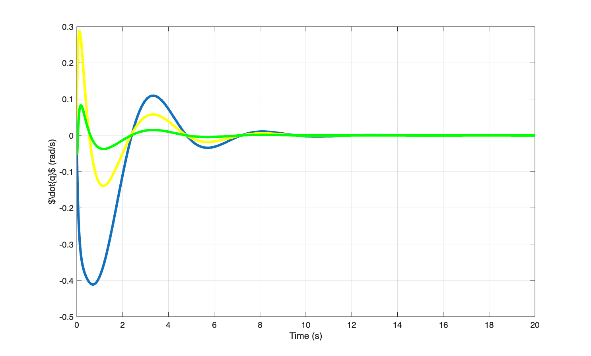
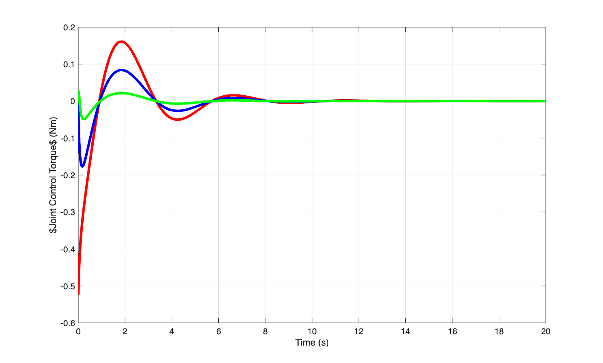
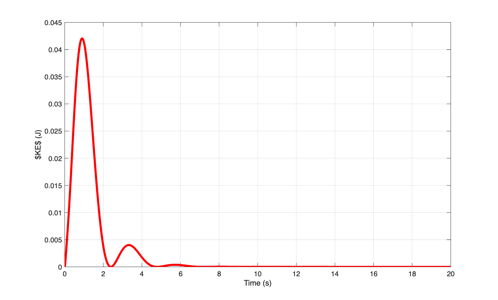
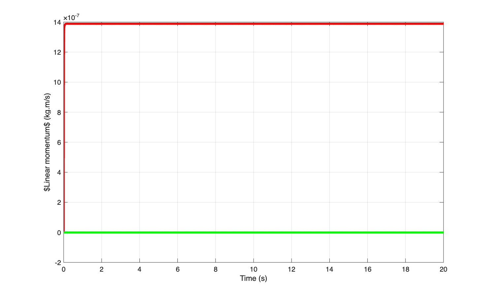
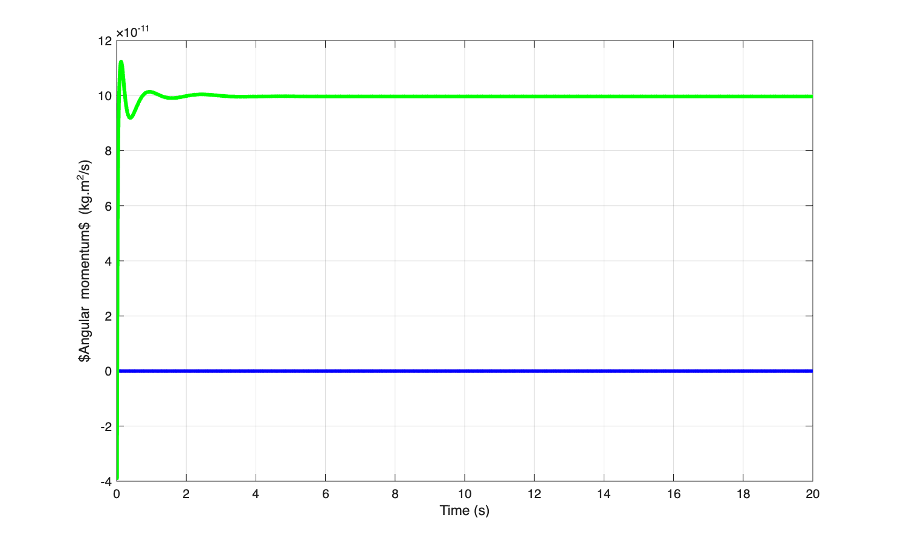

<p align="center">
  
</p>

## Planar Free-Floating Space Manipulator: Modeling and Control

This repository contains the modeling, simulation, and control implementation of a planar free-floating Space Manipulator System (SMS) with a three-link robotic manipulator mounted on a freely floating spacecraft base.

The project is developed progressively, beginning with forward-kinematics verification and dynamic modeling, followed by the development of PID, Sliding Mode Control (SMC), and nonlinear Model Predictive Control (MPC).
Two MPC implementations are provided: a conventional MATLAB implementation using `fmincon` and a CasADi-based implementation using symbolic dynamics, automatic differentiation, single-shooting prediction, and Sequential Quadratic Programming (SQP).

The current validated CasADi implementation uses SQP with an exact Hessian and QRQP as the underlying quadratic-programming solver.

---

## Project Objectives

The main objectives of this project are:

1. Develop and validate the forward kinematics of a planar free-floating space manipulator.
2. Formulate the equations of motion of the coupled spacecraft-manipulator system.
3. Analyze the dynamic coupling between manipulator motion and spacecraft-base motion.
4. Implement classical control approaches for the manipulator.
5. Develop a nonlinear Model Predictive Controller using conventional MATLAB optimization.
6. Develop a CasADi-based MPC implementation using symbolic dynamics and automatic differentiation.
7. Compare the conventional and CasADi-based MPC implementations in terms of computational performance and control behavior.

---

# System Description

The system considered in this project consists of:

- A freely floating spacecraft base.
- A three-link planar robotic manipulator.
- Revolute joints connecting the manipulator links.
- No external force or torque acting on the free-floating system.
- Dynamic coupling between the spacecraft base and manipulator motion.

The generalized coordinates describe the spacecraft base motion together with the manipulator joint configuration.

For the general SMS formulation, the generalized coordinates are represented by the spacecraft translational and rotational states together with the manipulator joint coordinates.

---

# Mathematical Formulation

The complete derivation of the free-floating space manipulator equations of motion is available here.

📄 **(docs/Derivation.pdf)**

## Development Stages

The repository follows a progressive controller-development workflow:

### Stage 1 - Forward Kinematics

Verification of the planar free-floating SMS geometry and end-effector
kinematics.

### Stage 2 - Dynamic Modeling

Derivation and implementation of the coupled spacecraft-manipulator dynamics,
including the dynamic coupling between manipulator motion and spacecraft-base
motion.

### Stage 3 - PID Control

Development of a classical PID controller as an initial control baseline.

### Stage 4 - Sliding Mode Control

Development of a nonlinear Sliding Mode Controller for the SMS.

### Stage 5 - Traditional MPC

Development of a nonlinear single-shooting MPC using MATLAB numerical
optimization (`fmincon`).

### Stage 6 - CasADi MPC

Replacement of the repeated numerical optimization-model evaluations with a
CasADi symbolic model and automatic differentiation.

The current validated implementation uses:

CasADi → RK4 → Single Shooting → SQP → Exact Hessian → QRQP

## Forward Kinematics

The first stage of the project is the verification of the planar
free-floating SMS forward kinematics.

The implementation is located in:

Matlab_FK/

with:

- `Forward_kinematics_planar_FFSMS.m` - forward-kinematics implementation.
- `Matlab_FK_Test.m` - forward-kinematics verification/testing.

The FK stage establishes the geometric relationship between the spacecraft
base, manipulator configuration, and end-effector before introducing the
dynamic model and controllers.

## PD Controller (PID baseline directory)

The first controller implemented for the planar free-floating SMS is a
joint-space PD controller used as a classical baseline.

The controller tracks a desired manipulator configuration while the
spacecraft base remains unactuated. Consequently, manipulator motion
induces spacecraft-base motion through the dynamic coupling inherent to
the free-floating system.

### Control Law

The implemented controller is

$$
\tau_q =
K_p(q_d-q) + K_d(\dot q_d-\dot q),
$$

where

$$
q =
\begin{bmatrix}
q_1 & q_2 & q_3
\end{bmatrix}^T
$$

is the manipulator joint configuration.

The controller parameters are

$$
K_p = \mathrm{diag}(1,1,1),
\qquad
K_d = \mathrm{diag}(0.5,0.5,0.5).
$$

The desired configuration used in the baseline simulation is

$$
q_d =
\begin{bmatrix}
-0.523599\\
0\\
0
\end{bmatrix}
$$

corresponding approximately to

$$
q_d=[-30^\circ,\ 0^\circ,\ 0^\circ]^T,
$$

with zero desired joint velocity.

> **Note:** Although this controller is organized under the `PID`
> directory, the current implementation contains proportional and
> derivative terms only; therefore, it is technically a PD controller
> rather than a full PID controller.

### Free-Floating Dynamics

Only the three manipulator joints are actuated:

$$
\tau =
\begin{bmatrix}
0_{6\times1}\\
\tau_q
\end{bmatrix}.
$$

The spacecraft base is therefore unactuated and its motion arises from
the coupled SMS dynamics.

The generalized acceleration is obtained from

$$\ddot{\Phi} = H^{-1}(\tau - C_{\dot{\Phi}})$$

where $(H)$ is the generalized inertia matrix and
$(C_{\dot{\Phi}})$ contains the velocity-dependent dynamic terms.

## Simulation

The nonlinear dynamics are integrated using a custom fourth-order
Runge–Kutta (RK4) implementation with

$$
\Delta t = 0.01\ {\rm s}
$$

over a 20-second simulation.

The simulation records:

- spacecraft base position
- spacecraft base orientation
- manipulator joint angles
- spacecraft linear velocity
- spacecraft angular velocity
- joint velocities
- joint torques
- kinetic energy
- linear momentum
- angular momentum

## Files

| File | Description |
|---|---|
| `main.m` | Initializes and runs the PID/PD simulation and generates plots |
| `param.m` | Defines SMS physical parameters and controller gains |
| `Calc_rb.m` | Computes the initial base position from the system center-of-mass condition |
| `SMS_dynamics_PID.m` | Implements the nonlinear coupled SMS dynamics and PD controller |
| `rk4t_PID.m` | Fourth-order Runge–Kutta integration |

## Simulation Workflow

```text
Initial manipulator configuration
            ↓
     Calculate base position
            ↓
      Initialize 18 states
            ↓
       PD controller
            ↓
       Joint torques
            ↓
    Coupled SMS dynamics
            ↓
          RK4
            ↓
      Updated system state
            ↓
        Repeat in time
        
```

        
For the demonstrated simulation, the objective is to move the manipulator from its initial configuration to the prescribed joint-angle reference while observing the resulting reaction motion of the free-floating spacecraft base.

## Simulation Workflow

The PID simulation demonstrates the dynamic coupling between the manipulator and the free-floating spacecraft base.

The manipulator joints converge toward their commanded configuration, while the spacecraft base undergoes a corresponding translational and rotational motion despite receiving no direct control input.

Representative results are shown below.

#### Base Position

The manipulator motion induces a displacement of the spacecraft base. In the demonstrated simulation, the steady-state base displacement is approximately

$$
\Delta x_b \approx -0.055\ {\rm m},
$$

and

$$
\Delta y_b \approx 0.009\ {\rm m}.
$$

This illustrates the reaction motion generated by manipulator actuation in a free-floating system.



#### Base Orientation

The spacecraft base also experiences a significant attitude change due to the conservation of angular momentum. The final base orientation is approximately

$$
\Delta\epsilon_b \approx 0.22\ {\rm rad}
\approx 12.6^\circ.
$$



#### Manipulator Joint Angles

The joint angles converge toward their commanded values under PID control. The transient response exhibits oscillatory behavior before reaching the final configuration.



#### Joint Rates

The joint angular velocities decay toward zero as the manipulator reaches its commanded configuration.



#### Control Torques

The required joint torques are largest during the initial transient and subsequently decay toward zero as the joint tracking error and joint rates decrease.



#### Kinetic Energy

The kinetic energy exhibits a transient response associated with the initial manipulator motion and subsequently approaches a small steady-state value as the system settles.



---

## 5. Conservation-Law Validation

Because the system is modeled as a free-floating spacecraft-manipulator system with no external force or torque, the total linear and angular momentum should remain constant:

$$
\frac{dP}{dt}=0,
\qquad
\frac{dM}{dt}=0.
$$

The total linear momentum is calculated as

$$
P =
m_bv_b+
\sum_{i=1}^{3}m_iv_i,
$$

where $(v_b)$ is the spacecraft base velocity and $(v_i)$ is the velocity of the center of mass of link $(i)$.

The total angular momentum is calculated about the inertial-frame origin as

$$
M =
\sum_{i}
\left(
I_i^N\omega_i
+
r_i\times m_iv_i
\right),
$$

including the spacecraft base and all three manipulator links.

The numerical conservation error is evaluated relative to the initial momentum:

$$
\Delta P(t)=P(t)-P(0),
$$

$$
\Delta M(t)=M(t)-M(0).
$$

The maximum conservation errors obtained in the simulation are:

| Quantity | $(dt)$ | $(dt/2)$ |
|:--|--:|--:|
| $(\max_t\|\Delta P\|$) | $6.21\times10^{-5}$ kg·m/s | $3.88\times10^{-6}$ kg·m/s |
| $(\max_t\|\Delta M\|$) | $4.46\times10^{-9}$ kg·m²/s | $3.01\times10^{-10}$ kg·m²/s |


### RK4 Timestep Convergence

To distinguish numerical integration error from a modeling inconsistency, the RK4 timestep was reduced by a factor of two.

The linear momentum error changed from

$$
6.21\times10^{-5}
\rightarrow
3.88\times10^{-6},
$$

which corresponds to a reduction by approximately a factor of

$$
\frac{6.21\times10^{-5}}
{3.88\times10^{-6}}
\approx 16.
$$

This is consistent with the expected fourth-order convergence of RK4:

$$
E_{\mathrm{RK4}}=O(dt^4).
$$

Similarly, the angular momentum error decreased from

$$
4.46\times10^{-9}
\rightarrow
3.01\times10^{-10}.
$$

The strong reduction in momentum drift with decreasing timestep indicates that the observed conservation error is primarily associated with numerical integration rather than a persistent violation of the underlying conservation laws.





Therefore, the numerical dynamics model demonstrates conservation of total linear and angular momentum to within the expected numerical integration error for the RK4 simulation.

## Sliding Mode Control (SMC)

Sliding Mode Control (SMC) is implemented to provide robust joint-space tracking for the free-floating Space Manipulator System (SMS). Unlike the PID controller, the SMC formulation explicitly incorporates the dynamic coupling between the spacecraft base and the manipulator.

The complete SMS dynamics are represented as

$$
H(\Phi)\ddot{\Phi}+C(\Phi,\dot{\Phi})=\tau
$$

where

$$
\Phi =
\begin{bmatrix}
x_b & y_b & z_b & \phi_b & \theta_b & \psi_b & q_1 & q_2 & q_3
\end{bmatrix}^{T}
$$

is the generalized coordinate vector, $H$ is the inertia matrix, $C$ contains the velocity-dependent terms, and

$$
\tau =
\begin{bmatrix}
0_{6\times1}\\
\tau_q
\end{bmatrix}
$$

because the spacecraft base is free-floating and the actuators apply torques only at the manipulator joints.

The equations of motion are obtained from the Lagrangian formulation of the free-floating SMS. Since gravity is neglected in the microgravity environment, the Lagrangian is equal to the kinetic energy of the system. The resulting inertia matrix naturally contains the base-manipulator coupling terms. 

### Coupling-Compensated Reduced-Order Dynamics

For controller design, the full dynamics are partitioned into base and manipulator components:

```math
\begin{bmatrix}
H_{bb} & H_{bq} \\
H_{bq}^{T} & H_{qq}
\end{bmatrix}
\begin{bmatrix}
\ddot{x}_b \\
\ddot{q}
\end{bmatrix}
+
\begin{bmatrix}
C_b \\
C_q
\end{bmatrix}
=
\begin{bmatrix}
0 \\
\tau_q
\end{bmatrix}
```


where

- $x_b\in\mathbb{R}^{6}$ represents the base translational and rotational coordinates,
- $q\in\mathbb{R}^{3}$ represents the manipulator joint coordinates,
- $H_{bb}$ is the base inertia matrix,
- $H_{bq}$ represents base-manipulator inertial coupling,
- $H_{qq}$ is the joint-space inertia matrix.

Since no external control torque is applied to the free-floating base,

$$
H_{bb}\ddot{x}_b+H_{bq}\ddot{q}+C_b=0
$$

and therefore

$$ \ddot{x}_b = -H_{bb}^{-1} (H_{bq}\ddot{q}+C_b).$$

Substituting this relation into the joint-space dynamics gives the coupling-compensated reduced-order model

$$
H_r(q)\ddot{q}+C_r(q,\dot q)=\tau_q
$$

where

$$ H_r = H_{qq} - H_{bq}^{T}H_{bb}^{-1}H_{bq} $$

and

$$ C_r = C_q - H_{bq}^{T}H_{bb}^{-1}C_b. $$

This reduction is important for the free-floating SMS because manipulator motion induces spacecraft base motion through conservation of momentum. The base motion is therefore not independently controlled; instead, its effect is incorporated into the reduced joint dynamics through the coupling terms.

### Sliding Surface

The tracking error is defined as

$$
e=q-q_d
$$

and

$$
\dot e=\dot q-\dot q_d.
$$

For the rest-to-rest tracking task considered here,

$$
\dot q_d=0.
$$

A first-order sliding surface is selected as

$$
s=\dot e+\Lambda e
$$

where

$$
\Lambda=5I_{3}.
$$

Thus,

$$
s=
\dot q-\dot q_d+
\Lambda(q-q_d).
$$

When the system reaches the sliding manifold,

$$
s=0,
$$

the tracking error follows

$$
\dot e+\Lambda e=0,
$$

which gives exponentially convergent tracking error dynamics.

### SMC Control Law

Differentiating the sliding surface gives

$$\dot{s} = \ddot e+\Lambda\dot e. $$

For a constant desired joint configuration,

$$
\ddot e=\ddot q
$$

and therefore

$$ \dot{s} = \ddot q+\Lambda\dot e.$$

The desired sliding dynamics are selected as

```math
\dot{s} = -K_s\,\mathrm{sat}\left(\frac{s}{\phi_s}\right)
```

where $K_s$ is the switching gain and $\phi_s$ defines a boundary layer around the sliding surface.

Therefore, the desired joint acceleration is

```math
\ddot q_{\mathrm{des}} = -\Lambda\dot e - K_s\mathrm{sat} (\frac{s}{\phi_s}).
```

Using the coupling-compensated reduced-order dynamics,

$$
H_r\ddot q+C_r=\tau_q,
$$

the SMC control torque is obtained as

```math
\boxed{
\tau_q
=
C_r
+
H_r
\left[
-\Lambda\dot e
-
K_s\mathrm{sat}
\left(
\frac{s}{\phi_s}
\right)
\right]
}
```

which can be separated into an equivalent and switching component:

```math
\tau_q
=
\tau_{\mathrm{eq}}
+
\tau_{\mathrm{sw}}
```

with

```math
\tau_{\mathrm{eq}}
=
C_r-H_r\Lambda\dot e
```

and

```math
\tau_{\mathrm{sw}}
=
-H_rK_s
\mathrm{sat}
\left(
\frac{s}{\phi_s}
\right).
```

### Boundary-Layer Switching

To reduce the high-frequency chattering associated with the ideal sign function, the discontinuous switching term is replaced by a saturation function:

```math
\mathrm{sat}(z)=
\begin{cases}
-1, & z<-1\\
z, & |z|\leq1\\
1, & z>1.
\end{cases}
```

The resulting implementation is

```math
\mathrm{sat}
\left(
\frac{s_i}{\phi_{s,i}}
\right)
=
\begin{cases}
-1, & s_i<-\phi_{s,i}\\
\dfrac{s_i}{\phi_{s,i}}, & |s_i|\leq\phi_{s,i}\\
1, & s_i>\phi_{s,i}.
\end{cases}
```

The selected SMC parameters are

$$
\Lambda=5I_3,
$$

```math
K_s=
\begin{bmatrix}
2\\2\\2
\end{bmatrix},
```

and

```math
\phi_s=
\begin{bmatrix}
0.05\\0.05\\0.05
\end{bmatrix}.
```

The commanded joint torques are additionally constrained by the actuator limits

$$
|\tau_{q_1}|\leq5~\mathrm{Nm},
$$

$$
|\tau_{q_2}|\leq2.5~\mathrm{Nm},
\qquad
|\tau_{q_3}|\leq2.5~\mathrm{Nm}.
$$

These limits are applied after computing the SMC control torque.

### SMC Implementation Summary

The implemented control architecture can therefore be summarized as

```math
\boxed{
\begin{aligned}
e &= q-q_d\\
s &= \dot e+\Lambda e\\
H_r &= H_{qq}-H_{bq}^{T}H_{bb}^{-1}H_{bq}\\
C_r &= C_q-H_{bq}^{T}H_{bb}^{-1}C_b\\
\tau_q &=
C_r+
H_r
\left[
-\Lambda\dot e
-K_s\mathrm{sat}\left(\frac{s}{\phi_s}\right)
\right].
\end{aligned}
}
```

The resulting torque is applied only to the three manipulator joints, while the spacecraft base remains dynamically free. Consequently, the base translation and rotation observed during the simulation arise naturally from the reaction motion associated with manipulator actuation and the conservation of system momentum.

The SMC simulation is integrated using a fourth-order Runge-Kutta scheme with a simulation step of $0.01$ s. The controller returns both the joint torque and sliding-surface variables for evaluating the closed-loop response.

## Files

| File | Description |
|---|---|
| `main.m` | Initializes and runs the SMC simulation and generates plots |
| `param.m` | Defines SMS physical parameters and sliding-mode controller gains |
| `Calc_rb.m` | Computes the initial base position from the system center-of-mass condition |
| `SMS_dynamics_SMC.m` | Implements the nonlinear coupled SMS dynamics and sliding-mode controller |
| `rk4t_SMC.m` | Fourth-order Runge-Kutta integration |

## Traditional Model Predictive Control (MPC)

A nonlinear receding-horizon MPC using direct single shooting is implemented to perform constrained joint-space tracking of the free-floating Space Manipulator System (SMS).

Unlike PID and SMC, which compute the control torque directly from the current tracking error, MPC predicts the future system evolution over a finite prediction horizon and determines an optimal sequence of joint torques. Only the first torque in the optimized sequence is applied to the system, after which the optimization is repeated using the updated state.

The controller uses the complete nonlinear SMS dynamics, including the dynamic coupling between the spacecraft base and the manipulator.

### State-Space Representation

The generalized coordinates of the SMS are

```math
\Phi =
\begin{bmatrix}
x_b & y_b & z_b &
\phi_b & \theta_b & \psi_b &
q_1 & q_2 & q_3
\end{bmatrix}^{T}
```

and the complete state is defined as

```math
x =
\begin{bmatrix}
\Phi\\
\dot{\Phi}
\end{bmatrix}
\in\mathbb{R}^{18}.
```

Thus,

```math
x =
\begin{bmatrix}
x_b & y_b & z_b &
\phi_b & \theta_b & \psi_b &
q_1 & q_2 & q_3 &
\dot{x}_b & \dot{y}_b & \dot{z}_b &
\dot{\phi}_b & \dot{\theta}_b & \dot{\psi}_b &
\dot q_1 & \dot q_2 & \dot q_3
\end{bmatrix}^{T}.
```

The control input consists of the three manipulator joint torques:

```math
u=\tau_q=
\begin{bmatrix}
\tau_1 & \tau_2 & \tau_3
\end{bmatrix}^{T}.
```

No direct control input is applied to the free-floating spacecraft base.

The nonlinear SMS dynamics are written in the form

```math
H(\Phi)\ddot{\Phi}+C(\Phi,\dot{\Phi})=
\begin{bmatrix}
0_{6\times1}\\
\tau_q
\end{bmatrix},
```

which gives the continuous-time state-space model

$$
\dot{x}=f(x,u).
$$

The nonlinear dynamics used by the MPC are the same coupled SMS dynamics used for simulation. The model therefore predicts both the manipulator motion and the reaction motion induced on the free-floating base.

### Prediction Model

At every MPC update, the current measured or simulated state $x_k$ is used as the initial condition.

For a candidate control sequence

```math
U=
\begin{bmatrix}
u_0^T & u_1^T & \cdots & u_{N_p-1}^T
\end{bmatrix}^{T},
```

the nonlinear model predicts the future states according to

$$
x_{i+1}=F(x_i,u_i),
$$

where $F(\cdot)$ is the discrete-time representation of the nonlinear SMS dynamics.

The continuous-time dynamics are integrated using a fourth-order Runge-Kutta method:

$$
k_1=f(x_i,u_i)
$$

$$
k_2=f(x_i+\frac{\Delta t}{2}k_1,u_i)
$$

$$
k_3=f(x_i+\frac{\Delta t}{2}k_2,u_i)
$$

$$
k_4=f(x_i+\Delta t k_3,u_i)
$$

and

```math
x_{i+1}
=
x_i+
\frac{\Delta t}{6}
(k_1+2k_2+2k_3+k_4).
```

The implementation uses

```math
\Delta t=0.01~\mathrm{s}.
```

The RK4 integrator is implemented in `rk4t_MPC.m`. 

### Finite-Horizon Optimization

At every sampling instant, MPC solves for the sequence of future joint torques that minimizes a finite-horizon cost.

The objective function is

```math
\boxed{
J=
\sum_{i=1}^{N_p}
[
(x_i-x_{\mathrm{ref}})^T
Q
(x_i-x_{\mathrm{ref}})
+
u_i^T R u_i
]
}
```

where

- $N_p$ is the prediction horizon,
- $x_i$ is the predicted state,
- $x_{\mathrm{ref}}$ is the desired state,
- $Q$ weights state-tracking errors,
- $R$ penalizes control effort.

The reference state is

```math
x_{\mathrm{ref}}=0
```

except for the desired first joint configuration:

```math
q_{1,\mathrm{ref}}=0.872665~\mathrm{rad}
\approx50^\circ,
```

while

```math
q_{2,\mathrm{ref}}=q_{3,\mathrm{ref}}=0.
```

The selected weighting matrices are

```math
Q=
\mathrm{diag}
\left(
0,0,0,0,0,0,
200,150,150,
0,0,0,0,0,0,
20,20,20
\right)
```

and

```math
R=
\mathrm{diag}(0.01,0.01,0.01).
```

Therefore, the MPC primarily penalizes manipulator joint-position error and joint velocity, while the spacecraft base states are not directly included in the tracking cost. The control penalty discourages unnecessarily large joint torques. 

### Actuator Constraints

The optimization explicitly considers the available joint-torque limits:

```math
-\tau_{\max}\leq u_i\leq\tau_{\max}
```

with

```math
\tau_{\max}
=
\begin{bmatrix}
5\\
2.5\\
2.5
\end{bmatrix}
\mathrm{Nm}.
```

Thus,

```math
-5\leq\tau_1\leq5~\mathrm{Nm},
```

```math
-2.5\leq\tau_2\leq2.5~\mathrm{Nm},
```

and

```math
-2.5\leq\tau_3\leq2.5~\mathrm{Nm}.
```

The torque limits are imposed over the entire prediction horizon. No explicit state constraints are included in this implementation. 

### Nonlinear Optimization

Because the SMS model is nonlinear, the MPC optimization problem is nonlinear.

The decision vector contains all joint torques over the prediction horizon:

```math
U\in\mathbb{R}^{3N_p}.
```

For the implemented prediction horizon,

$$
N_p=15,
$$

giving

```math
U\in\mathbb{R}^{45}.
```

The optimization problem is therefore

```math
\boxed{
\begin{aligned}
\min_U \quad&
\sum_{i=1}^{N_p}
\left[
(x_i-x_{\mathrm{ref}})^TQ(x_i-x_{\mathrm{ref}})
+
u_i^TRu_i
\right]
\\
\text{subject to}\quad&
x_{i+1}=F(x_i,u_i),
\\
&
-\tau_{\max}\leq u_i\leq\tau_{\max}.
\end{aligned}
}
```

The MATLAB implementation solves this nonlinear optimization problem using `fmincon` with the Sequential Quadratic Programming (SQP) algorithm. 

This implementation uses a **single-shooting formulation**: the optimization variables are the future control inputs, while the predicted states are generated by repeatedly propagating the nonlinear SMS model from the current state.

### Receding-Horizon Control

After solving the optimization problem, the complete optimal torque sequence is obtained:

```math
U^\ast=
\begin{bmatrix}
u_0^\ast &
u_1^\ast &
\cdots &
u_{N_p-1}^\ast
\end{bmatrix}.
```

Only the first control action is applied:

```math
\boxed{
u_k=u_0^\ast
}
```

The system is then propagated for one sampling interval, producing the new state

$$
x_{k+1}=F(x_k,u_k).
$$

At the next sampling instant, the optimization is repeated using $x_{k+1}$ as the new initial condition.

Thus, the control loop is

```math
x_k
\rightarrow
\text{prediction}
\rightarrow
\text{optimization}
\rightarrow
U^\ast
\rightarrow
u_0^\ast
\rightarrow
x_{k+1}
\rightarrow
\text{repeat}.
```

### Warm Starting

To improve the optimization efficiency, the previous optimal control sequence is retained and shifted forward by one control interval.

If

```math
U_{k-1}^\ast=
\begin{bmatrix}
u_0^\ast & u_1^\ast & \cdots & u_{N_p-1}^\ast
\end{bmatrix},
```

the initial guess for the next optimization is constructed as

```math
U_k^{(0)}
=
\begin{bmatrix}
u_1^\ast &
u_2^\ast &
\cdots &
u_{N_p-1}^\ast &
u_{N_p-1}^\ast
\end{bmatrix}.
```

This provides the nonlinear optimizer with a solution that is close to the expected optimum at the next sampling instant and reduces unnecessary re-optimization from zero. 
### MPC Implementation Summary

The complete traditional MPC architecture can be summarized as

```math
\boxed{
\begin{aligned}
x_{k+1} &= F(x_k,u_k),\\[2mm]
J &= \sum_{i=1}^{N_p}
\left[
(x_i-x_{\mathrm{ref}})^TQ(x_i-x_{\mathrm{ref}})
+
u_i^TRu_i
\right],\\[2mm]
U^\ast &= \arg\min_U J,\\[2mm]
-\tau_{\max}&\leq u_i\leq\tau_{\max},\\[2mm]
u_k&=u_0^\ast.
\end{aligned}
}
```

The implemented controller uses a 15-step prediction horizon with a 0.01 s sampling interval, corresponding to a 0.15 s prediction window. The nonlinear SMS dynamics are propagated using fourth-order Runge-Kutta integration, and the resulting constrained optimization problem is solved using MATLAB's SQP-based `fmincon` solver.

The controller therefore moves from instantaneous feedback control toward **optimization-based predictive control**, while explicitly accounting for the nonlinear coupled dynamics and actuator limitations of the free-floating SMS.

## Files

| File | Description |
|---|---|
| `main.m` | Initializes and runs the MPC simulation and generates plots |
| `param.m` | Defines SMS physical parameters and MPC tuning parameters |
| `Calc_rb.m` | Computes the initial base position from the system center-of-mass condition |
| `SMS_dynamics_MPC.m` | Implements the nonlinear coupled SMS dynamics used by the MPC |
| `MPC_Controller.m` | Computes the optimal control input using the receding-horizon MPC formulation |
| `CostFunction.m` | Defines the MPC objective function for tracking performance and control effort |
| `rk4t_MPC.m` | Fourth-order Runge-Kutta integration for the SMS dynamics |

---

## CasADi + SQP Nonlinear MPC

The final controller in the current development replaces the MATLAB `fmincon` optimization framework with a **CasADi-based nonlinear programming formulation and SQP solver**.

The fundamental MPC formulation remains the same as the traditional nonlinear MPC:

- nonlinear SMS prediction,
- RK4 integration,
- finite-horizon cost,
- joint torque constraints,
- single-shooting formulation,
- receding-horizon control.

The main difference is the computational framework used to construct and solve the nonlinear optimization problem.

The implementation is located in:

```text
Planar_3_linkSMS_Controller/MPC_using_CasADi_SQP/
├── BuildSolver.m
├── Calc_rb.m
├── main.m
├── MPC_Controller_Casadi.m
├── param.m
├── rk4t_Casadi.m
└── SMS_Model_Casadi.m
```

### CasADi-Based SMS Model

The nonlinear SMS dynamics are constructed using CasADi symbolic variables.

The generalized momentum is

```math
p=
\frac{\partial T}{\partial\dot\Phi}.
```

The inertia matrix is obtained using automatic differentiation:

```math
H=
\frac{\partial p}{\partial\dot\Phi}.
```

The remaining nonlinear terms are

```math
C=
\frac{\partial p}{\partial\Phi}\dot\Phi
-
\frac{\partial T}{\partial\Phi}.
```

The dynamics are therefore

```math
H(\Phi)\ddot\Phi+C(\Phi,\dot\Phi)=\tau
```

and

```math
\ddot\Phi
=
H^{-1}
(\tau-C).
```

The CasADi model is implemented in `SMS_Model_Casadi.m`.

### Automatic Differentiation

CasADi automatically differentiates the symbolic model.

For example:

```matlab
p = gradient(T,dPhi);

H = jacobian(p,dPhi);
```

The remaining dynamic terms are generated from the same symbolic expressions.

This avoids manually constructing large analytical derivative expressions and allows the derivatives required by the nonlinear optimizer to be generated automatically.

### RK4 Prediction

The continuous-time model

$$
\dot{x}=f(x,u)
$$

is discretized using fourth-order Runge-Kutta integration:

```math
k_1=f(x_k,u_k)
```

```math
k_2=
f\left(
x_k+\frac{\Delta t}{2}k_1,u_k
\right)
```

```math
k_3=
f\left(
x_k+\frac{\Delta t}{2}k_2,u_k
\right)
```

```math
k_4=
f\left(
x_k+\Delta t k_3,u_k
\right)
```

and

```math
x_{k+1}
=
x_k+
\frac{\Delta t}{6}
(k_1+2k_2+2k_3+k_4).
```

The implementation uses

```math
\Delta t=0.01~\mathrm{s}.
```

### MPC Prediction Horizon

The CasADi MPC uses

$$
N_p=12
$$

prediction steps.

With

```math
\Delta t=0.01~\mathrm{s},
```

the prediction window is

```math
T_p=N_p\Delta t
=0.12~\mathrm{s}.
```

Since there are three control inputs,

$$
n_u=3,
$$

the number of optimization variables is

$$
N_pn_u=12\times3=36.
$$

Thus,

```math
U\in\mathbb{R}^{36}.
```

### Cost Function

The finite-horizon objective is

```math
J=
\sum_{i=1}^{N_p}
\left[
(x_i-x_{\mathrm{ref}})^TQ(x_i-x_{\mathrm{ref}})
+
u_i^TRu_i
\right].
```

The implemented weighting matrices are

```math
Q=
\mathrm{diag}
\left(
0,0,0,0,0,0,
200,150,150,
0,0,0,0,0,0,
20,20,20
\right)
```

and

```math
R=
\mathrm{diag}(0.01,0.01,0.01).
```

### Input Constraints

The actuator limits are

```math
-5\leq\tau_1\leq5~\mathrm{Nm},
```

```math
-2.5\leq\tau_2\leq2.5~\mathrm{Nm},
```

```math
-2.5\leq\tau_3\leq2.5~\mathrm{Nm}.
```

These limits are applied across the entire prediction horizon.

### CasADi NLP

The optimization variables are the future torque sequence:

```math
U=
\begin{bmatrix}
u_0\\
u_1\\
\vdots\\
u_{N_p-1}
\end{bmatrix}.
```

The current state and reference are supplied as parameters:

```math
P=
\begin{bmatrix}
x_0\\
x_{\mathrm{ref}}
\end{bmatrix}.
```

The nonlinear program is

```math
\boxed{
\begin{aligned}
\min_U\quad&
J(U,x_0,x_{\mathrm{ref}})
\\
\text{subject to}\quad&
LB\leq U\leq UB.
\end{aligned}
}
```

The predicted states are generated internally through nonlinear RK4 propagation, so the formulation remains a single-shooting MPC problem.

### SQP Solver

The active optimization method is CasADi's SQP solver:

```matlab
opts = struct;

opts.max_iter = 50;

opts.qpsol = 'qrqp';
```

The solver is created using:

```matlab
solver = nlpsol( ...
    'solver', ...
    'sqpmethod', ...
    nlp, ...
    opts);
```

Thus, the computational structure is

$$
\boxed{
\text{Nonlinear NLP}
\rightarrow
\text{SQP}
\rightarrow
\text{QRQP}
}
$$

The active implementation uses the SQP solver with its exact Hessian treatment. Alternative Hessian approximations were investigated during development but are not part of the frozen working implementation.

### Solver Construction and Online Operation

The solver is constructed once rather than rebuilding the symbolic model at every MPC step.

The initialization sequence is:

```text
CasADi symbolic variables
        ↓
Nonlinear SMS model
        ↓
RK4 prediction model
        ↓
MPC cost function
        ↓
NLP construction
        ↓
SQP + QRQP solver
```

During online operation, only the numerical parameters such as the current state and reference are updated.

### Warm Starting

The previous optimal torque sequence is shifted forward and used as the initial guess for the next optimization:

```math
U_k^{(0)}
=
\begin{bmatrix}
u_1^*&
u_2^*&
\cdots&
u_{N_p-1}^*&
u_{N_p-1}^*
\end{bmatrix}^{T}.
```

This provides the SQP solver with a starting point close to the expected solution.

### Receding-Horizon Control

After optimization,

```math
U^*
=
\begin{bmatrix}
u_0^*&
u_1^*&
\cdots&
u_{N_p-1}^*
\end{bmatrix}^{T},
```

only the first torque is applied:

```math
\boxed{
u_k=u_0^*
}
```

The SMS is then propagated for one timestep:

```math
x_{k+1}=F(x_k,u_k).
```

The optimization is repeated using the updated state.

### Computational Performance

The CasADi + SQP implementation was developed to improve the computational efficiency of the nonlinear MPC implementation.

The symbolic model and NLP are constructed once, while the online loop repeatedly evaluates the already constructed solver.

For the tested configuration, the frozen SQP implementation was substantially faster than the traditional `fmincon` implementation.

The online MPC computation time is recorded at each control step.

### Traditional MPC vs. CasADi + SQP

| Feature | Traditional MPC | CasADi + SQP MPC |
|:--|:--|:--|
| SMS model | Nonlinear | Nonlinear |
| Prediction | RK4 | RK4 |
| Formulation | Single shooting | Single shooting |
| Sampling time | 0.01 s | 0.01 s |
| Prediction horizon | 15 | 12 |
| Optimization variables | 45 | 36 |
| Optimizer | MATLAB `fmincon` | CasADi `sqpmethod` |
| QP solver | Internal | `qrqp` |
| Automatic differentiation | No | Yes |
| Symbolic dynamics | No | Yes |
| Warm start | Yes | Yes |
| Torque constraints | Yes | Yes |

The key transition is from a MATLAB-based nonlinear optimization implementation to a symbolic and automatically differentiated nonlinear MPC implementation.

---

## Overall Control Development

The complete project therefore progresses from basic kinematic verification to increasingly sophisticated control methods:

```text
Forward Kinematics
        ↓
Dynamic SMS Model
        ↓
PID
        ↓
Sliding Mode Control
        ↓
Traditional Nonlinear MPC
        ↓
CasADi + SQP Nonlinear MPC
```

The progression demonstrates the transition from direct feedback control toward model-based predictive control and finally toward a symbolic, automatically differentiated nonlinear optimization framework.

The current CasADi + SQP implementation provides the foundation for future extensions such as:

- additional state constraints,
- collision avoidance,
- dynamic-coupling-aware MPC objectives,
- control allocation,
- nonlinear terminal costs,
- improved real-time performance.
