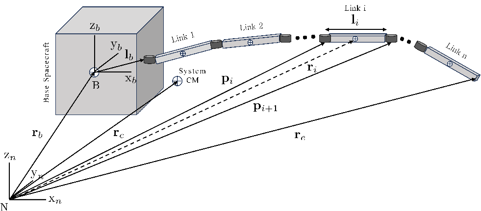

<p align="center">
  
</p>
# Planar Free-Floating Space Manipulator: Modeling and Control

This repository contains the modeling, simulation, and control implementation of a planar free-floating Space Manipulator System (SMS) with a three-link robotic manipulator mounted on a freely floating spacecraft base.

The project is developed progressively, beginning with forward-kinematics verification and dynamic modeling, followed by the development of PID, Sliding Mode Control (SMC), and nonlinear Model Predictive Control (MPC).
Two MPC implementations are provided: a conventional MATLAB implementation using `fmincon` and a CasADi-based implementation using symbolic dynamics, automatic differentiation, single-shooting prediction, and Sequential Quadratic Programming (SQP).

The current validated CasADi implementation uses SQP with an exact Hessian and QRQP as the underlying quadratic-programming solver.

---

## Project Objectives

The main objectives of this project are:

1. Develop and validate the forward kinematics of a planar free-floating space manipulator.
2. Formulate the equations of motion of the coupled spacecraft-manipulator system.
3. Analyze the dynamic coupling between manipulator motion and spacecraft-base motion.
4. Implement classical control approaches for the manipulator.
5. Develop a nonlinear Model Predictive Controller using conventional MATLAB optimization.
6. Develop a CasADi-based MPC implementation using symbolic dynamics and automatic differentiation.
7. Compare the conventional and CasADi-based MPC implementations in terms of computational performance and control behavior.

---

# System Description

The system considered in this project consists of:

- A freely floating spacecraft base.
- A three-link planar robotic manipulator.
- Revolute joints connecting the manipulator links.
- No external force or torque acting on the free-floating system.
- Dynamic coupling between the spacecraft base and manipulator motion.

The generalized coordinates describe the spacecraft base motion together with the manipulator joint configuration.

For the general SMS formulation, the generalized coordinates are represented by the spacecraft translational and rotational states together with the manipulator joint coordinates.

---

# Mathematical Formulation

The complete derivation of the free-floating space manipulator equations of motion is available here.

📄 **(docs/Derivation.pdf)**

## Development Stages

The repository follows a progressive controller-development workflow:

### Stage 1 — Forward Kinematics

Verification of the planar free-floating SMS geometry and end-effector
kinematics.

### Stage 2 — Dynamic Modeling

Derivation and implementation of the coupled spacecraft-manipulator dynamics,
including the dynamic coupling between manipulator motion and spacecraft-base
motion.

### Stage 3 — PID Control

Development of a classical PID controller as an initial control baseline.

### Stage 4 — Sliding Mode Control

Development of a nonlinear Sliding Mode Controller for the SMS.

### Stage 5 — Traditional MPC

Development of a nonlinear single-shooting MPC using MATLAB numerical
optimization (`fmincon`).

### Stage 6 — CasADi MPC

Replacement of the repeated numerical optimization-model evaluations with a
CasADi symbolic model and automatic differentiation.

The current validated implementation uses:

CasADi → RK4 → Single Shooting → SQP → Exact Hessian → QRQP

## Forward Kinematics

The first stage of the project is the verification of the planar
free-floating SMS forward kinematics.

The implementation is located in:

Matlab_FK/

with:

- `Forward_kinematics_planar_FFSMS.m` — forward-kinematics implementation.
- `Matlab_FK_Test.m` — forward-kinematics verification/testing.

The FK stage establishes the geometric relationship between the spacecraft
base, manipulator configuration, and end-effector before introducing the
dynamic model and controllers.

## PD Controller (PID baseline directory)

The first controller implemented for the planar free-floating SMS is a
joint-space PD controller used as a classical baseline.

The controller tracks a desired manipulator configuration while the
spacecraft base remains unactuated. Consequently, manipulator motion
induces spacecraft-base motion through the dynamic coupling inherent to
the free-floating system.

### Control Law

The implemented controller is

$$
\tau_q =
K_p(q_d-q) + K_d(\dot q_d-\dot q),
$$

where

$$
q =
\begin{bmatrix}
q_1 & q_2 & q_3
\end{bmatrix}^T
$$

is the manipulator joint configuration.

The controller parameters are

$$
K_p = \mathrm{diag}(1,1,1),
\qquad
K_d = \mathrm{diag}(0.5,0.5,0.5).
$$

The desired configuration used in the baseline simulation is

$$
q_d =
\begin{bmatrix}
-0.523599\\
0\\
0
\end{bmatrix}
$$

corresponding approximately to

$$
q_d=[-30^\circ,\ 0^\circ,\ 0^\circ]^T,
$$

with zero desired joint velocity.

> **Note:** Although this controller is organized under the `PID`
> directory, the current implementation contains proportional and
> derivative terms only; therefore, it is technically a PD controller
> rather than a full PID controller.

### Free-Floating Dynamics

Only the three manipulator joints are actuated:

$$
\tau =
\begin{bmatrix}
0_{6\times1}\\
\tau_q
\end{bmatrix}.
$$

The spacecraft base is therefore unactuated and its motion arises from
the coupled SMS dynamics.

The generalized acceleration is obtained from

```math
\ddot{\Phi}
=
H^{-1}
\left(
\tau - C_{\dot{\Phi}}
\right)

where $(H)$ is the generalized inertia matrix and
$(C_{\dot{\Phi}})$ contains the velocity-dependent dynamic terms.

### Simulation

The nonlinear dynamics are integrated using a custom fourth-order
Runge–Kutta (RK4) implementation with

\[
\Delta t = 0.01\ {\rm s}
\]

over a 20-second simulation.

The simulation records:

- spacecraft base position
- spacecraft base orientation
- manipulator joint angles
- spacecraft linear velocity
- spacecraft angular velocity
- joint velocities
- joint torques
- kinetic energy
- linear momentum
- angular momentum

### Files

| File | Description |
|---|---|
| `main.m` | Initializes and runs the PID/PD simulation and generates plots |
| `param.m` | Defines SMS physical parameters and controller gains |
| `Calc_rb.m` | Computes the initial base position from the system center-of-mass condition |
| `SMS_dynamics_PID.m` | Implements the nonlinear coupled SMS dynamics and PD controller |
| `rk4t_PID.m` | Fourth-order Runge–Kutta integration |

### Simulation Workflow

```text
Initial manipulator configuration
            ↓
     Calculate base position
            ↓
      Initialize 18 states
            ↓
       PD controller
            ↓
       Joint torques
            ↓
    Coupled SMS dynamics
            ↓
          RK4
            ↓
      Updated system state
            ↓
        Repeat in time

        

For the demonstrated simulation, the objective is to move the manipulator from its initial configuration to the prescribed joint-angle reference while observing the resulting reaction motion of the free-floating spacecraft base.

### Simulation Results

The PID simulation demonstrates the dynamic coupling between the manipulator and the free-floating spacecraft base.

The manipulator joints converge toward their commanded configuration, while the spacecraft base undergoes a corresponding translational and rotational motion despite receiving no direct control input.

Representative results are shown below.

#### Base Position

The manipulator motion induces a displacement of the spacecraft base. In the demonstrated simulation, the steady-state base displacement is approximately

\[
\Delta x_b \approx -0.055\ {\rm m},
\]

and

\[
\Delta y_b \approx 0.009\ {\rm m}.
\]

This illustrates the reaction motion generated by manipulator actuation in a free-floating system.


#### Base Orientation

The spacecraft base also experiences a significant attitude change due to the conservation of angular momentum. The final base orientation is approximately

\[
\Delta\epsilon_b \approx 0.22\ {\rm rad}
\approx 12.6^\circ.
\]


#### Manipulator Joint Angles

The joint angles converge toward their commanded values under PID control. The transient response exhibits oscillatory behavior before reaching the final configuration.


#### Joint Rates

The joint angular velocities decay toward zero as the manipulator reaches its commanded configuration.


#### Control Torques

The required joint torques are largest during the initial transient and subsequently decay toward zero as the joint tracking error and joint rates decrease.


#### Kinetic Energy

The kinetic energy exhibits a transient response associated with the initial manipulator motion and subsequently approaches a small steady-state value as the system settles.


---

## 5. Conservation-Law Validation

Because the system is modeled as a free-floating spacecraft-manipulator system with no external force or torque, the total linear and angular momentum should remain constant:

\[
\frac{dP}{dt}=0,
\qquad
\frac{dM}{dt}=0.
\]

The total linear momentum is calculated as

\[
P =
m_bv_b+
\sum_{i=1}^{3}m_iv_i,
\]

where \(v_b\) is the spacecraft base velocity and \(v_i\) is the velocity of the center of mass of link \(i\).

The total angular momentum is calculated about the inertial-frame origin as

\[
M =
\sum_{i}
\left(
I_i^N\omega_i
+
r_i\times m_iv_i
\right),
\]

including the spacecraft base and all three manipulator links.

The numerical conservation error is evaluated relative to the initial momentum:

\[
\Delta P(t)=P(t)-P(0),
\]

\[
\Delta M(t)=M(t)-M(0).
\]

The maximum conservation errors obtained in the simulation are:

| Quantity | \(dt\) | \(dt/2\) |
|:--|--:|--:|
| \(\max_t\|\Delta P\|\) | \(6.21\times10^{-5}\) kg·m/s | \(3.88\times10^{-6}\) kg·m/s |
| \(\max_t\|\Delta M\|\) | \(4.46\times10^{-9}\) kg·m²/s | \(3.01\times10^{-10}\) kg·m²/s |

The final errors for the reduced timestep case are

\[
\|\Delta P(T)\|
=
3.88\times10^{-6}\ {\rm kg\,m/s},
\]

and

\[
\|\Delta M(T)\|
=
3.01\times10^{-10}\ {\rm kg\,m^2/s}.
\]

### RK4 Timestep Convergence

To distinguish numerical integration error from a modeling inconsistency, the RK4 timestep was reduced by a factor of two.

The linear momentum error changed from

\[
6.21\times10^{-5}
\rightarrow
3.88\times10^{-6},
\]

which corresponds to a reduction by approximately a factor of

\[
\frac{6.21\times10^{-5}}
{3.88\times10^{-6}}
\approx 16.
\]

This is consistent with the expected fourth-order convergence of RK4:

\[
E_{\mathrm{RK4}}=O(dt^4).
\]

Similarly, the angular momentum error decreased from

\[
4.46\times10^{-9}
\rightarrow
3.01\times10^{-10}.
\]

The strong reduction in momentum drift with decreasing timestep indicates that the observed conservation error is primarily associated with numerical integration rather than a persistent violation of the underlying conservation laws.


Therefore, the numerical dynamics model demonstrates conservation of total linear and angular momentum to within the expected numerical integration error for the RK4 simulation.